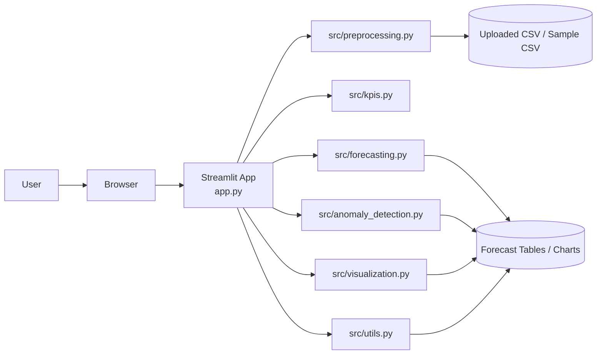
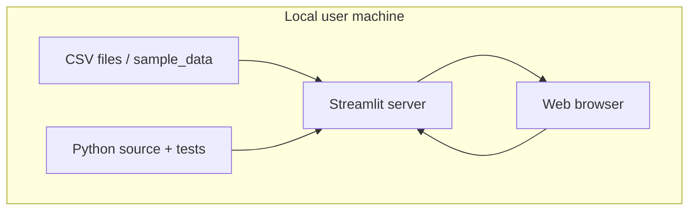
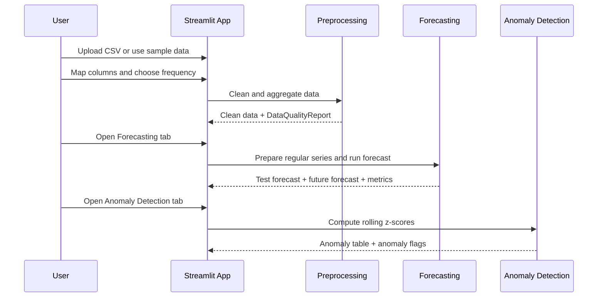

# ForeSightSeer: Technical Documentation

## Problem Statement

Small and medium-sized enterprises often have sales data in CSV files but lack a simple analytical system for validating data quality, monitoring revenue KPIs, forecasting future demand, and detecting unusual trends. This project provides a Streamlit dashboard that converts uploaded sales data into actionable business insights using explainable statistical methods.

## System Architecture

The application is organized as a small modular Python project:

- `app.py`: Streamlit user interface and workflow orchestration.
- `src/features.py`: calendar, holiday, and promotion feature engineering helpers.
- `src/preprocessing.py`: CSV cleaning, validation, data quality reporting, and aggregation.
- `src/kpis.py`: KPI and revenue growth calculations.
- `src/forecasting.py`: Moving Average, Exponential Smoothing, Linear Regression, regularized forecast frames, train/test split, MAE, and MAPE.
- `src/anomaly_detection.py`: Rolling z-score anomaly detection.
- `src/visualization.py`: Plotly chart construction.
- `src/utils.py`: formatting, CSV export, and helper functions.
- `tests/`: pytest tests for the core business logic.

The Streamlit app receives user input, delegates reusable calculations to `src/`, and displays tables, metrics, charts, warnings, and downloads.

## Architecture Views

### Component View



### Deployment View



### Interaction Flow



## Technology Stack and Justification

The main project technologies are:

- Python 3.10+ as the implementation language.
- Streamlit (requirements: `streamlit>=1.32`) for rapid development of an interactive analytical dashboard.
- pandas (`pandas>=2.0`) for data manipulation, cleaning, and aggregation.
- NumPy (`numpy>=1.24`) for numerical operations.
- Plotly (`plotly>=5.18`) for interactive visualizations.
- scikit-learn (`scikit-learn>=1.3`) for MAE calculation.
- statsmodels (`statsmodels>=0.14`) for Exponential Smoothing and Linear Regression prediction intervals.
- pytest (`pytest>=8.0`) for automated regression testing.

These choices are appropriate for the project because they prioritize readability, fast iteration, statistical transparency, and reproducibility. The system is intentionally implemented as a Python-first analytical product rather than as a distributed web system with a separate frontend/backend split.

## User Interface and External Interfaces

The system does not expose a public REST API or database interface. Its primary interface is the Streamlit web application, and its external data exchange happens through CSV import and CSV export.

### Main Interface Areas

- Sidebar data source section for CSV upload or sample-data fallback.
- Column-mapping controls for date, revenue, optional transactions, optional holiday/promotion indicators, and optional categorical dimensions.
- Aggregation selector for daily, weekly, and monthly analysis.
- Optional categorical filters.
- Overview tab for KPIs and revenue visualizations.
- Data Quality tab for cleaning results and cleaned-data previews.
- Forecasting tab for multi-model comparison, confidence levels, interpretable coefficients, segment comparison, evaluation metrics, and future forecasts.
- Anomaly Detection tab for rolling z-score controls and anomaly tables.
- Export tab for downloading processed outputs.

### Exported Files

- `cleaned_aggregated_sales.csv`
- `forecast_results.csv`
- `anomaly_results.csv`

This UI-focused design is aligned with the project goal of delivering a practical SME dashboard rather than a backend platform.

## Installation, Configuration, and Troubleshooting

### Installation

1. Create a virtual environment with `python3 -m venv .venv`.
2. Activate the environment with `source .venv/bin/activate`.
3. Install dependencies with `pip install -r requirements.txt`.
4. Start the application with `streamlit run app.py`.

### Configuration

The project does not require environment variables or external services. Runtime behavior is configured through the Streamlit UI:

- selected columns,
- selected aggregation frequency,
- forecasting methods and horizon,
- confidence level,
- moving average window,
- trend/seasonality options,
- optional holiday and promotion columns,
- anomaly window and threshold,
- categorical filters.

### Troubleshooting

- If the app does not start, confirm the virtual environment is active and the dependencies are installed.
- If tests fail with import issues, run them from the project root after activating the virtual environment.
- If a CSV loads incorrectly, verify delimiter format and selected columns.
- If Exponential Smoothing returns warnings, use Moving Average or provide more historical data.
- If Linear Regression performs poorly, verify the holiday/promotion columns and compare it against the simpler baselines before using it in the final demo.
- If MAPE is unavailable, the evaluation slice likely contains only zero actual values.

## Preprocessing Pipeline

The preprocessing pipeline performs the following steps:

1. Validate that the selected date and revenue columns exist.
2. Remove exact duplicate rows.
3. Rename selected fields to standardized names: `date`, `revenue`, and optionally `transactions`.
4. Preserve optional holiday or promotion columns with their original names for later feature engineering.
5. Convert the selected date column to pandas datetime.
6. Convert revenue and transaction columns to numeric values.
7. Remove rows with invalid dates.
8. Remove rows with missing or non-numeric revenue.
9. Remove negative revenue rows by default.
10. Normalize invalid transaction values to zero so transaction-based KPIs remain usable.
11. Clip negative transaction values to zero and report how many corrections were made.
12. Sort rows chronologically.
13. Return a `DataQualityReport` with row counts, unique removed rows, transaction corrections, missing values, and date range.

Negative revenue values are removed instead of forecasted because the dashboard is intended for simple revenue forecasting. In a real accounting dataset, negative rows could represent returns or refunds and may need a separate business rule.

Rows removed for invalid data are reported as a unique count after deduplication, which avoids double-counting rows that have more than one issue, such as an invalid date and missing revenue on the same record.

## Aggregation

The dashboard supports:

- Daily aggregation.
- Weekly aggregation using week-start labels.
- Monthly aggregation using month-start labels.

Revenue is aggregated using sum. Transactions are also summed when a transaction column is selected.
When optional holiday or promotion indicator columns are present, the aggregation keeps the strongest signal in each period using max so a weekly or monthly bucket still reflects whether the event occurred.

## KPI Module

The KPI module calculates:

- Total revenue.
- Average revenue.
- Maximum revenue.
- Minimum revenue.
- Total transactions, if available.
- Average order value, if transactions are available.
- Latest period-over-period revenue growth.

Period-over-period growth compares the most recent aggregated period against the previous aggregated period. If the previous period has zero revenue, growth is reported as unavailable.

## Forecasting Module

The forecasting module uses a chronological train/test split:

- First 80% of observations for training.
- Last 20% for testing.
- No random shuffling, because this is time-series data.

### Moving Average

The Moving Average method uses a walk-forward evaluation. For each test period, it predicts revenue using the average of the most recent `window` values, then adds the actual test value to the history before predicting the next test period. Future forecasts are generated recursively.

### Exponential Smoothing

Exponential Smoothing is implemented with `statsmodels.tsa.holtwinters.ExponentialSmoothing`. The app supports:

- Optional additive trend.
- Optional additive seasonality when there are enough training observations.

The module catches model fitting errors and returns user-facing warnings instead of crashing the dashboard. When a confidence level is selected, the dashboard also computes approximate prediction intervals from the residual scale so the user can see uncertainty bands around test and future forecasts.

### Linear Regression with Calendar Features

The project also includes an interpretable Linear Regression model built from a deterministic feature matrix. The feature set includes:

- time index,
- day-of-week and month indicators,
- day-of-month and week-of-year values,
- quarter, month-start, and month-end flags,
- built-in holiday flags,
- optional uploaded holiday indicators,
- optional uploaded promotion indicators.

This model is useful when revenue responds to regular calendar structure or known events. Coefficients are exposed in the UI so the user can explain which signals push the forecast up or down.

### Multi-Model Evaluation

The Forecasting tab can run several models on the same chronological split. It presents a comparison table with MAE, MAPE, forecast lengths, and warnings so the user can justify which model was chosen for the detailed view or the final demo.

### Segment Comparison

The Forecasting tab can also compare the future forecast across the top segments of one selected categorical dimension, such as product category or store. This provides a more decision-oriented view than a single aggregated forecast.

## Evaluation Metrics

### MAE

Mean Absolute Error is calculated with scikit-learn. It measures the average absolute difference between actual and predicted revenue.

### MAPE

Mean Absolute Percentage Error is calculated manually so zero actual values can be handled safely. Rows where actual revenue is zero are excluded from MAPE. If every actual value is zero, MAPE returns `NaN` and the app explains why.

## Missing Dates

Before forecasting, the module creates a regular time series for the selected aggregation frequency. Missing periods are filled with zero revenue and reported as warnings. This prevents model crashes but may not match every business interpretation of missing data.

## Anomaly Detection Method

The anomaly detection module uses rolling z-scores:

1. Shift revenue by one period so the current observation is compared only to previous observations.
2. Calculate rolling mean and rolling standard deviation.
3. Calculate z-score as `(current revenue - rolling mean) / rolling standard deviation`.
4. Flag rows where `abs(z-score)` is greater than the selected threshold.

The output includes:

- `rolling_mean`
- `rolling_std`
- `z_score`
- `is_anomaly`

This approach is interpretable and easy to explain, but it is sensitive to outliers, window size, and threshold selection.

## Testing Approach

Pytest tests cover the most important business logic:

- Invalid dates and missing revenue are removed.
- Duplicate rows are removed.
- Rows with multiple issues are counted once in the total removed-row metric.
- Invalid and negative transaction values are reported when normalized to zero.
- Daily, weekly, and monthly aggregation preserves revenue and transaction totals.
- Optional event columns are preserved through preprocessing and aggregation.
- Calendar feature engineering produces a stable design matrix for future forecasts.
- MAPE ignores zero actual values.
- MAPE returns `NaN` if all actual values are zero.
- Moving Average returns the expected output shape.
- Exponential Smoothing can emit prediction intervals.
- Linear Regression returns prediction intervals and interpretable coefficients.
- Too-few-observation forecasting returns warnings instead of crashing.
- Anomaly detection returns required output columns.

The Streamlit interface itself is not unit-tested; the test suite focuses on reusable pure-Python logic in `src/`.

For reproducibility, the tests can be executed directly from the project root after activating the virtual environment with the standard command:

```bash
pytest
```

## Limitations

- Moving Average and Exponential Smoothing use only historical revenue.
- Linear Regression captures calendar structure and optional event indicators, but it still does not model richer business drivers such as price changes, competitor activity, or marketing spend.
- The sample data is synthetic and should not be interpreted as real business performance.
- Missing dates are filled with zero revenue for forecasting.
- Exponential Smoothing may not be suitable for highly intermittent sales.
- Linear Regression may underperform when the data pattern is weakly explained by calendar or event features.
- The app is designed for interactive analysis, not automated production forecasting.
- There is no authentication, database, or real-time ingestion.

