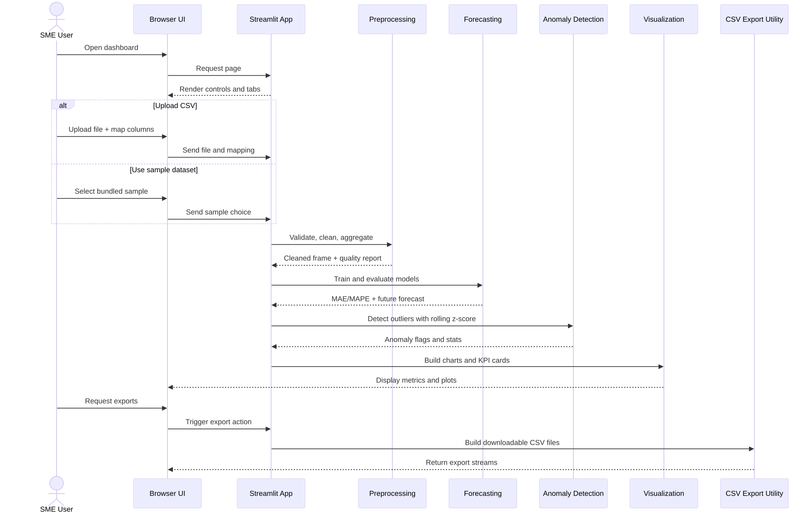

ForeSightSeer: Technical Documentation

1. Problem Statement

Small and medium sized enterprises often keep sales data in CSV files. They still need a simple way to check data quality, track revenue KPIs, forecast future demand, and find unusual trends.


2. System Architecture

The application uses a small modular Python structure.

app.py
Runs the Streamlit interface and controls the user workflow.

src/features.py
Creates calendar, holiday, and promotion features.

src/preprocessing.py
Cleans CSV files, validates inputs, reports data quality, and aggregates sales data.

src/kpis.py
Calculates KPIs and revenue growth.

src/forecasting.py
Runs Moving Average, Exponential Smoothing, Linear Regression, regular forecast frames, train and test splits, MAE, and MAPE.

src/anomaly_detection.py
Detects anomalies with rolling z scores.

src/visualization.py
Builds Plotly charts.

src/utils.py
Handles formatting, CSV export, and helper functions.

tests/
Stores pytest tests for the core business logic.

The Streamlit app receives the users' input, sends reusable calculations to the src modules, and shows tables, metrics, charts, warnings, and downloads.

3. UML Diagrams

The project stores UML diagram source files under:

- docs/assets/uml_diagrams/component_diagram.mmd
- docs/assets/uml_diagrams/deployment_diagram.mmd
- docs/assets/uml_diagrams/sequence_diagram.mmd

The rendered files used in reports and slides are:

- docs/assets/uml_diagrams/component_diagram.svg
- docs/assets/uml_diagrams/component_diagram.png
- docs/assets/uml_diagrams/deployment_diagram.svg
- docs/assets/uml_diagrams/deployment_diagram.png
- docs/assets/uml_diagrams/sequence_diagram.svg
- docs/assets/uml_diagrams/sequence_diagram.png

3.1 UML Component Diagram



Reading focus:

1. Entry points: user interaction and data input channels.
2. Orchestration layer: Streamlit app as the workflow coordinator.
3. Domain modules: preprocessing, features, KPIs, forecasting, anomaly detection, and visualization.
4. Output paths: rendered visuals and CSV exports.

3.2 UML Deployment Diagram



Reading focus:

1. Execution boundary: all components run on one local machine.
2. Runtime boundary: Streamlit process and Python modules inside the virtual environment.
3. Data lifecycle: local CSV inputs to in-app analytics to local CSV outputs.

3.3 UML Sequence Diagram



Reading focus:

1. Startup and interaction initiation.
2. Dataset selection branch (upload vs bundled sample).
3. Processing pipeline order: preprocessing to forecasting to anomaly detection to visualization.
4. Export path for final artifacts.

4. Diagram Regeneration Workflow


```bash
python render_uml.py
```

The renderer fetches Mermaid output and writes both SVG and PNG files, ensuring diagrams load reliably in markdown viewers and slide tools.

5. Technology Stack and Justification

The project uses these technologies.

Python 3.10+
Runs the application and all analytical logic.

Streamlit, version 1.32 or later
Builds the interactive dashboard quickly.

pandas, version 2.0 or later
Cleans, transforms, and aggregates data.

NumPy, version 1.24 or later
Handles numerical operations.

Plotly, version 5.18 or later
Creates interactive charts.

scikit-learn, version 1.3 or later
Calculates MAE.

statsmodels, version 0.14 or later
Runs Exponential Smoothing and supports prediction intervals for Linear Regression.

pytest, version 8.0 or later
Runs automated regression tests.


6. User Interface and External Interfaces

The system does not expose a public REST API or database interface. You interact with it through the Streamlit web application. You exchange data through CSV upload and CSV export.

6.1 Main Interface Areas

The dashboard includes these areas.

1. Sidebar data source section for CSV upload or sample data fallback.
2. Column mapping controls for date, revenue, optional transactions, optional holiday and promotion indicators, and optional categorical dimensions.
3. Aggregation selector for daily, weekly, and monthly analysis.
4. Optional categorical filters.
5. Overview tab for KPIs and revenue charts.
6. Data Quality tab for cleaning results and cleaned data previews.
7. Forecasting tab for model comparison, confidence levels, interpretable coefficients, segment comparison, evaluation metrics, and future forecasts.
8. Anomaly Detection tab for rolling z score controls and anomaly tables.
9. Export tab for downloading processed outputs.

6.2 Exported Files

The dashboard exports these files.

1. cleaned_aggregated_sales.csv
2. forecast_results.csv
3. anomaly_results.csv

This UI focused design supports the project goal. It gives SMEs a practical dashboard instead of a backend platform.

6.3 Saved Dashboards

The app also stores named dashboard snapshots locally.

1. The uploaded or bundled CSV is saved as compressed raw bytes.
2. The current widget state is saved as JSON alongside the data snapshot.
3. Saved dashboards are listed in the sidebar so users can load or delete them later.
4. Reloading a saved dashboard restores the source selection, column mappings, filters, and analysis controls before the charts render.

The implementation uses a local SQLite database under `runtime/saved_dashboards.db`. Because the store lives on disk inside the app runtime.

7. Installation, Configuration, and Troubleshooting

7.1 Installation

Create a virtual environment.

```bash
python3 -m venv .venv
```

Activate the environment.

```bash
source .venv/bin/activate
```

Install dependencies.

```bash
pip install -r requirements.txt
```

Start the application.

```bash
streamlit run app.py
```

7.2 Configuration

The project does not require environment variables or external services. You configure runtime behavior through the Streamlit UI.

You can set these options.

1. Selected columns.
2. Selected aggregation frequency.
3. Forecasting methods and horizon.
4. Confidence level.
5. Moving average window.
6. Trend and seasonality options.
7. Optional holiday and promotion columns.
8. Anomaly window and threshold.
9. Categorical filters.

7.3 Troubleshooting

If the app does not start, confirm that you activated the virtual environment and installed the dependencies.

If tests fail with import issues, run them from the project root after you activate the virtual environment.

If a CSV loads incorrectly, check the delimiter and selected columns.

If Exponential Smoothing returns warnings, use Moving Average or provide more historical data.

If Linear Regression performs poorly, check the holiday and promotion columns. Compare it against simpler baselines before you use it in the final demo.

If MAPE is unavailable, the evaluation slice likely contains only zero actual values.

If saved dashboards disappear after a restart, the deployment is probably using ephemeral storage. Move the app to a host with persistent disk or mount a durable volume for `runtime/saved_dashboards.db`.

8. Preprocessing Pipeline

The preprocessing pipeline follows these steps.

1. Validate that the selected date and revenue columns exist.
2. Remove exact duplicate rows.
3. Rename selected fields to standard names: date, revenue, and transactions when available.
4. Preserve optional holiday or promotion columns with their original names for feature engineering.
5. Convert the selected date column to pandas datetime.
6. Convert revenue and transaction columns to numeric values.
7. Remove rows with invalid dates.
8. Remove rows with missing or non numeric revenue.
9. Remove negative revenue rows by default.
10. Normalize invalid transaction values to zero so transaction based KPIs remain usable.
11. Clip negative transaction values to zero and report how many values changed.
12. Sort rows by date.
13. Return a DataQualityReport with row counts, unique removed rows, transaction corrections, missing values, and date range.

The dashboard removes negative revenue values because it focuses on simple revenue forecasting. In a real accounting dataset, negative rows may represent returns or refunds. You should handle those cases with a separate business rule.

The dashboard reports removed rows as a unique count after deduplication. This avoids double counting rows that have more than one issue, such as an invalid date and missing revenue in the same record.

9. Aggregation

The dashboard supports three aggregation levels.

1. Daily aggregation.
2. Weekly aggregation using week start labels.
3. Monthly aggregation using month start labels.

The system sums revenue. When you select a transaction column, the system also sums transactions.

When optional holiday or promotion indicator columns exist, aggregation keeps the strongest signal in each period by using max. This means a weekly or monthly bucket still shows whether the event occurred.

10. KPI Module

The KPI module calculates these metrics.

1. Total revenue.
2. Average revenue.
3. Maximum revenue.
4. Minimum revenue.
5. Total transactions, when available.
6. Average order value, when transactions are available.
7. Latest period over period revenue growth.

Period over period growth compares the most recent aggregated period with the previous aggregated period. If the previous period has zero revenue, the dashboard reports growth as unavailable.

11. Forecasting Module

The forecasting module uses a chronological train and test split.

1. The first 80% of observations train the model.
2. The last 20% test the model.
3. The system does not shuffle rows because the data is time series data.

11.1 Moving Average

The Moving Average method uses walk forward evaluation. For each test period, it predicts revenue from the average of the most recent window values. Then it adds the actual test value to the history before predicting the next test period.

The method generates future forecasts recursively.

11.2 Exponential Smoothing

Exponential Smoothing uses statsmodels.tsa.holtwinters.ExponentialSmoothing. The app supports two options.

1. Additive trend.
2. Additive seasonality when the training data has enough observations.

The module catches model fitting errors and returns clear warnings instead of crashing the dashboard.

When you select a confidence level, the dashboard computes approximate prediction intervals from the residual scale. This helps you see uncertainty around test and future forecasts.

11.3 Linear Regression with Calendar Features

The project includes an interpretable Linear Regression model built from a deterministic feature matrix.

The feature set includes these signals.

1. Time index.
2. Day of week and month indicators.
3. Day of month and week of year values.
4. Quarter, month start, and month end flags.
5. Built in holiday flags.
6. Optional uploaded holiday indicators.
7. Optional uploaded promotion indicators.

This model works best when revenue follows calendar patterns or known events. The UI shows the coefficients so you can explain which signals push the forecast up or down.

11.4 Multi Model Evaluation

The Forecasting tab can run several models on the same chronological split. It shows a comparison table with MAE, MAPE, forecast lengths, and warnings. You can use that table to justify which model you chose for the detailed view or final demo.

11.5 Segment Comparison

The Forecasting tab can compare future forecasts across the top segments of one selected categorical dimension, such as product category or store. This gives you a more decision focused view than one aggregated forecast.

12. Evaluation Metrics

12.1 MAE

Mean Absolute Error measures the average absolute difference between actual and predicted revenue. The project calculates it with scikit-learn.

12.2 MAPE

Mean Absolute Percentage Error measures average percentage error. The project calculates it manually so it can handle zero actual values safely.

Rows where actual revenue equals zero are excluded from MAPE. If every actual value equals zero, MAPE returns NaN and the app explains why.

13. Missing Dates

Before forecasting, the module creates a regular time series for the selected aggregation frequency. It fills missing periods with zero revenue and reports warnings.

This prevents model crashes. It also needs careful interpretation because a missing period may mean missing data rather than zero sales.

14. Anomaly Detection Method

The anomaly detection module uses rolling z scores.

It follows these steps.

1. Shift revenue by one period so the current observation is compared only with previous observations.
2. Calculate rolling mean and rolling standard deviation.
3. Calculate z score as current revenue minus rolling mean, divided by rolling standard deviation.
4. Flag rows where the absolute z score is greater than the selected threshold.

The output includes these columns.

1. rolling_mean
2. rolling_std
3. z_score
4. is_anomaly

This approach is easy to explain. It also has limits. It is sensitive to outliers, window size, and threshold choice.

15. Testing Approach

Pytest tests cover the most important business logic.

1. Invalid dates and missing revenue are removed.
2. Duplicate rows are removed.
3. Rows with multiple issues are counted once in the total removed row metric.
4. Invalid and negative transaction values are reported when normalized to zero.
5. Daily, weekly, and monthly aggregation preserves revenue and transaction totals.
6. Optional event columns are preserved through preprocessing and aggregation.
7. Calendar feature engineering produces a stable design matrix for future forecasts.
8. MAPE ignores zero actual values.
9. MAPE returns NaN if all actual values are zero.
10. Moving Average returns the expected output shape.
11. Exponential Smoothing can emit prediction intervals.
12. Linear Regression returns prediction intervals and interpretable coefficients.
13. Too few observations in forecasting return warnings instead of crashing.
14. Anomaly detection returns required output columns.

The test suite does not unit test the Streamlit interface. It focuses on reusable pure Python logic in src.

For reproducibility, run the tests from the project root after you activate the virtual environment.

```bash
pytest
```

16. Limitations

The system has clear limits.

1. Moving Average and Exponential Smoothing use only historical revenue.
2. Linear Regression captures calendar structure and optional event indicators, but it does not model richer business drivers such as price changes, competitor activity, or marketing spend.
3. The sample data is synthetic. Do not treat it as real business performance.
4. Missing dates are filled with zero revenue for forecasting.
5. Exponential Smoothing can perform poorly on highly intermittent sales.
6. Linear Regression can perform poorly when calendar or event features do not explain the data pattern.
7. The app supports interactive analysis. It does not run automated production forecasting.
8. The project does not include authentication, a database, or real time ingestion.
