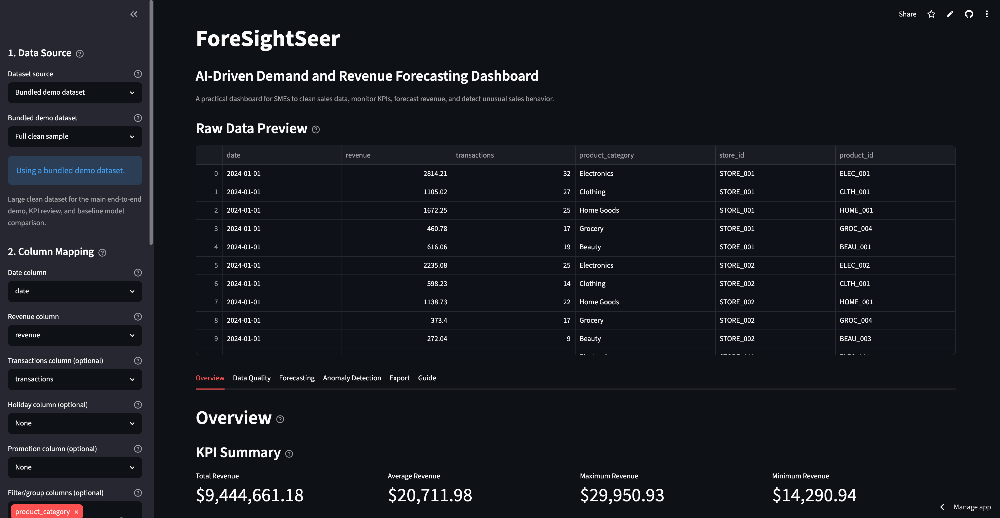
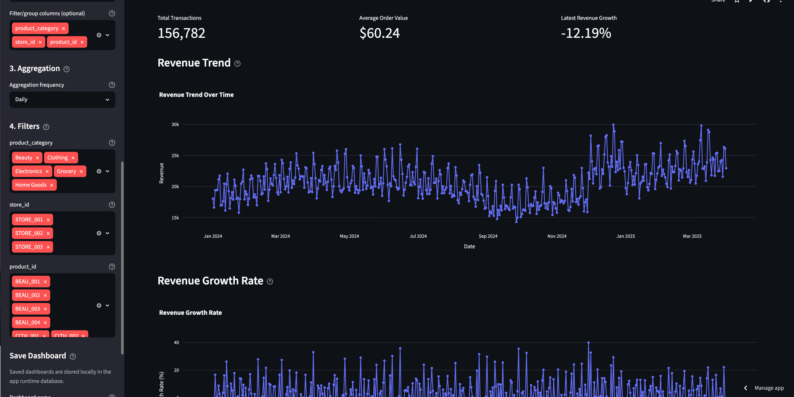
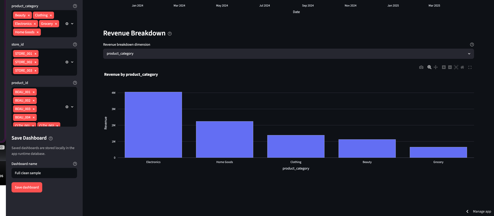
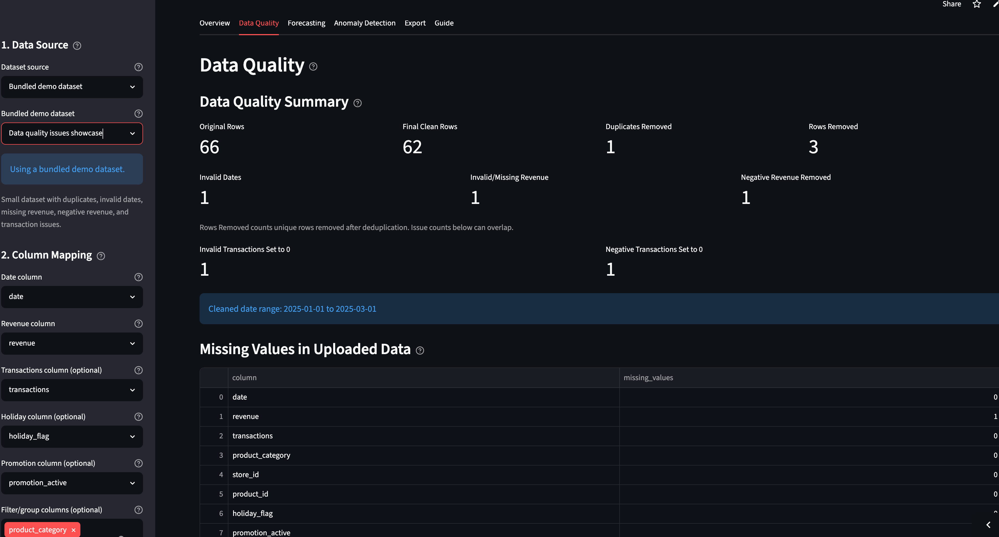
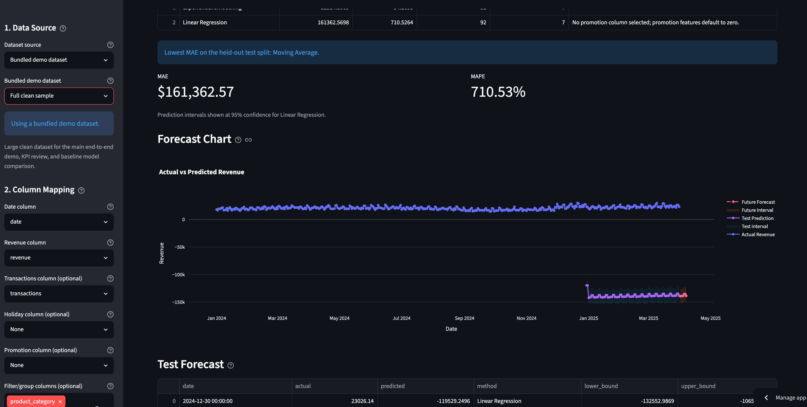
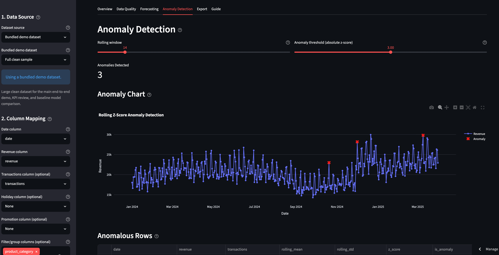
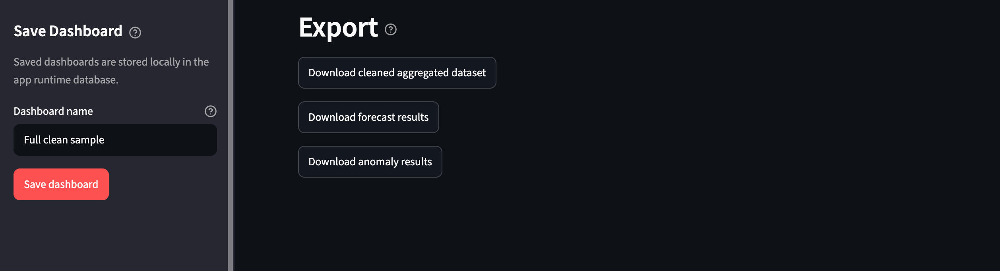

# ForeSightSeer: User Manual

## Purpose

This dashboard helps you upload sales data, clean it, check data quality, track revenue KPIs, forecast future revenue, find unusual sales trends, and export results.

The app also includes:

1. A built-in Guide tab that explains charts, data, and interpretation.
2. Small i help popovers next to the main sections inside the app.
3. Help text on important sidebar controls and forecasting options.

## Business Questions This Dashboard Answers

1. Can you trust this dataset before you show numbers to anyone?

Use the Data Quality tab. It shows what the app removed, what it normalized, and whether the cleaned data still looks usable.

2. What is happening in the business right now?

Use the Overview tab. It summarizes revenue level, growth, and segment contribution, so you can describe current performance quickly.

3. What should you expect next week or next month?

Use the Forecasting tab. Compare the models, review the future forecast table, and use the output to support inventory, staffing, or target-setting discussions.

4. Which periods need explanation before you act?

Use the Anomaly Detection tab. It highlights unusual spikes or drops that may come from promotions, outages, data issues, or real business events.

## Starting the App Locally

Open a terminal in the project folder and run:

```bash
python3 -m venv .venv
source .venv/bin/activate
pip install -r requirements.txt
```

Then start the dashboard:

```bash
streamlit run app.py
```

The app opens in your browser. If you don't upload a CSV file, the dashboard uses the bundled sample dataset.

If you're new to the app, open the Guide tab before you work with real data.


## Uploading Data

1. In Dataset source, choose a bundled demo dataset or Upload CSV.
2. If you upload a file, use the file uploader to select your CSV.
3. Confirm that the raw preview looks correct.
4. Select the date column.
5. Select the revenue column.
6. Select transactions, holiday, and promotion columns if you have them.
7. Select filter columns such as product category, store, or product ID if you need them.
8. Choose the aggregation frequency: Daily, Weekly, or Monthly.



Use the small i popovers in the app when you need help reading a section.

The app warns you when an uploaded CSV has no clear date or revenue column. It also warns you when sampled date or revenue values don't parse cleanly, when you select the same column for both date and revenue, or when the file has headers but no data rows.

## Using Filters

If you select filter columns, the sidebar shows filter controls. Choose the categories, stores, or products you want to analyze.

If you select all values, the dashboard analyzes the full cleaned dataset.

Filters change all KPIs, charts, forecasts, anomalies, and exports.


## Overview Tab

Business use: this is the fastest way to answer, "How is the business performing right now?"



The Overview tab shows:

1. Total revenue.
2. Average revenue.
3. Maximum revenue.
4. Minimum revenue.
5. Total transactions, if available.
6. Average order value, if transactions are available.
7. Latest revenue growth.

It also shows:

1. Revenue trend over time.
2. Revenue growth rate.
3. Revenue breakdown by selected category, store, or product.

Use the i help popovers beside the chart sections for simple interpretation guidance.




## Data Quality Tab

Business use: this tab is your trust checkpoint before you present KPIs or forecasts.



The Data Quality tab explains how the app cleaned the uploaded data. It shows:

1. Original row count.
2. Final cleaned row count.
3. Duplicate rows removed.
4. Unique rows removed because of invalid dates, invalid revenue, or negative revenue.
5. Invalid date rows removed.
6. Missing or invalid revenue rows removed.
7. Negative revenue rows removed.
8. Invalid transaction values set to zero.
9. Negative transaction values set to zero.
10. Missing values per original column.
11. Cleaned date range.
12. Cleaned and filtered data previews.

Use this tab to confirm that the dataset is suitable before you interpret KPIs and forecasts.

The total removed-row metric counts each removed row once. The issue-specific counters explain why the app flagged those rows.

## Forecasting Tab

Business use: this tab answers, "What should demand or revenue look like next, and how uncertain is that estimate?"



The Forecasting tab lets you choose:

1. One or more models to evaluate.
2. The model shown in detailed view.
3. Future forecast horizon.
4. Confidence level.
5. Optional segment comparison.
6. Moving average window.
7. Trend and optional seasonality for Exponential Smoothing.

The tab reports:

1. Model comparison table.
2. MAE, which shows average absolute forecast error.
3. MAPE, which shows average percentage forecast error and excludes zero actual revenue rows.
4. Actual vs predicted revenue chart.
5. Test forecast table.
6. Future forecast table.
7. Linear Regression coefficients, when you select that model.
8. Segment comparison output, when you enable it.

If the dataset is too short or the model cannot fit, the app shows a warning instead of stopping.

If you're new to forecasting, start with the model comparison table. Then inspect the forecast chart. Next, read the future forecast table as the decision output. Finally, check the test forecast table to understand past error behavior.

## Anomaly Detection Tab

Business use: this tab helps you decide which unusual periods need investigation before you change stock, staffing, or targets.



The Anomaly Detection tab uses rolling z scores to find unusual revenue values.

Controls:

1. Rolling window: how many previous periods define normal behavior.
2. Threshold: how extreme a z score must be before the app flags it.

Outputs:

1. Number of anomalies.
2. Chart with anomalies highlighted in red.
3. Table of anomalous rows.
4. Full anomaly results table.

Higher thresholds detect fewer anomalies. Lower thresholds detect more anomalies.

Use the i help beside the anomaly sections to understand what counts as unusual behavior and how to interpret the red markers.

## Export Tab

The Export tab provides downloads for these outputs:



1. Cleaned aggregated dataset.
2. Forecast results.
3. Anomaly results.

You can open these files in Excel, Google Sheets, or other reporting tools.

## Common Issues

If the CSV does not load, check that it is a valid comma-separated file.

If the app warns that no clear date column was found, confirm that the uploaded file includes a real date field before you continue.

If the app warns that no clear revenue column was found, confirm that the uploaded file includes a numeric revenue field.

If the app warns that the selected date or revenue field does not parse in sampled values, change the mapping before you trust the analysis.

If the file has headers but no data rows, add at least one valid sales row before you upload it again.

If you selected the same field as both date and revenue, choose two different columns. The app blocks that invalid setup.

If dates are removed, check that the selected date column contains parseable dates.

If revenue rows are removed, check for missing, text-based, or negative revenue values.

If transaction values are corrected to zero, check for text entries, blanks, or negative values in the selected transactions column.

If MAPE is unavailable, the test set likely has only zero actual revenue values.

If Exponential Smoothing shows a warning, use Moving Average or provide more historical data.
